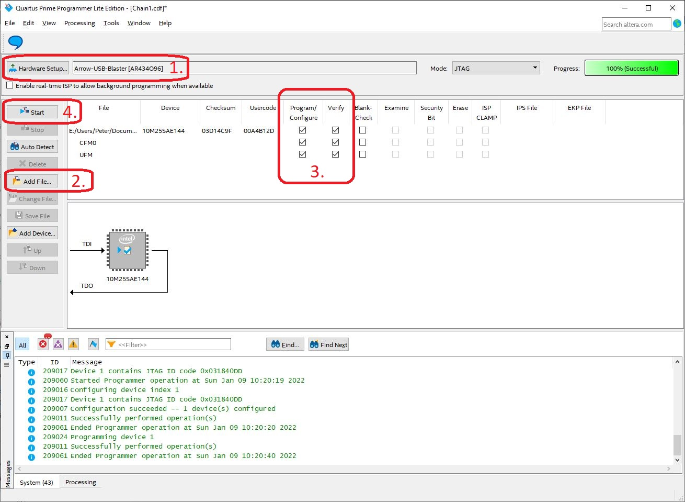

N64 Advanced version 2
---

### Table of Contents

- [User Information](https://github.com/borti4938/n64adv2_fw#user-information)
  - [OSD Menu](https://github.com/borti4938/n64adv2_fw#osd-menu)
  - [Default Configuration](https://github.com/borti4938/n64adv2_fw#default-configuration)
  - [Firmware Update](https://github.com/borti4938/n64adv2_fw#firmware-update)
- [Developer Information](https://github.com/borti4938/n64adv2_fw#developer-information)
  - [Repository Management](https://github.com/borti4938/n64adv2_fw#repository-management)
  - [Setup Toolchain](https://github.com/borti4938/n64adv2_fw#setup-toolchain)
  - [Build Firmware](https://github.com/borti4938/n64adv2_fw#build-firmware)


## User Information

### OSD Menu 

#### Overview and Navigation 

The on screen display (OSD) menu can be opened at any point where a game is reading the controller by pressing **D-ri + L + R + C-ri**. (D = D-Pad)


The menu always open in the top level, where you have following options available:

- **\[Video-Info\]**  
  Displays some (useful) information about current video input from N64 and settings
- **\[Resolution\]**  
  Change resolution of the digital output signal
- **\[Scaler\]**  
  Scaler settings
- **\[Scanlines\]**  
  Scanalines settings
- **\[VI-Processing\]**  
  Some video interface processing stuff other than resolution and scaling
- **\[Miscellaneous\]**  
  Audio settings, in-game routines settings
- **\[Save/Load/Fw.Update\]**  
  Save your current settings, load from settings or defaults, update the firmware
- **About...**  
  Some information on the project
- **Acknowledgment...**  
  Acknowledgement
- **License...**  
  License text

You navigate through the menu using the **D-Pad**, the **control stick** or the **C buttons**.
With up/down you go up and down, respectively, and with left/right you can change settings.
With **A** (or right) and **B** you can enter and leave a submenu.
Pressing B in the top menu closes the OSD.
Alternatively, you can use **D-le + L + R + C-le** to close the menu at any point.
If you feel to just undisplay the OSD for a brief moment to check your last settings change, just hold **L + Z**.
Note that the N64Adv2 does not actively read the controller.
As mentioned, the game must read it.

The following tables describe the different settings available.
The tables also show some default vaules.
An empty default value means that this value is not affected by loading defaults.

#### Video-Info

| Entry | Description |
|:------|:------------|
| **PPU state value** | A value provided by the picture processing unit of the FPGA as feedback |
| **Video mode - Input resolution** | Input resolution generated by the N64 |
| **Video mode - Output resolution** | Output resolution generated by the N64Adv2 |
| **Video mode - Scaled image size** | Virtual image size, which might be larger than what is fitted on the current output resolution |
| **Video mode - Low latency mode** | Shows whether frame locked mode is enabled or not.<br>In frame locked mode it will provide the actual number of scanlines pre-buffered for the output |
| **Filter Options - LowRes. VI-DeBlur** | Shows whether low resolution deblur is enabled or not.<br>- **off** = 640 horizontal pixel<br>- **on** = 320 horizontal pixel |
| **Filter Options - Gamma boost exponent** | Exponent of gamma correction (lower value means higher brightness) |

#### Resolution

| Entry | Default | Description |
|:------|:--------|:------------|
| **Input mode** \[1\] | | Mode where the following settings are applied |
| **Output resolution - 240p/288p (4:3)** | Off | Changes to 240p/288p (4:3 with pixel repetition) output resolution<br>Note that scaling options will be limited |
| **Output resolution - 480p/576p (4:3)** | On \[2\] | Changes to 480p/576p (4:3) output resolution |
| **Output resolution - 720p (16:9)** | Off | Changes to 720p (16:9) output resolution |
| **Output resolution - 960p (4:3)** | Off | Changes to 960p (4:3) resolution at output |
| **Output resolution - 1080p (16:9)** | On \[2\] | Changes to 1080p (16:9) output resolution |
| **Output resolution - 1200p (4:3)** | Off | Changes to 1200p (4:3) resolution with reduced blanking at output |
| **Output resolution - 1440p (4:3)** | _not available_ | Changes to 1440p (4:3) resolution with reduced blanking at output \[3\] |
| **Output resolution - 1440p (16:9)** | _not available_ | Changes to 1440p (16:9) resolution with reduced blanking at output \[3,4\] |
| **Use VGA instead of 480p** | Off | Determines whether you want to use VGA (640x480) instead of standard 480p (720x480).<br>Note that this option has no effect for 576p. |
| **Frame-Locked** | Off | Varies the pixel clock such that vertical sync matches the N64 generated vertical clock.<br>Vsync in this mode is slightly off spec. To my experience, NTSC runs fine on most TVs other than PAL.|
| **Force 50/60** | Off (N64 Auto) | Forces 50Hz or 60Hz vertical output frequency. This may introduce additional shudder when running PAL in 60Hz and NTSC in 50Hz.<br>This option becomes inaccessible in frame locked mode. |

\[1\] You are allowed to quickly change the _Input mode_ on this screen by pressing **L** or **R** on the controller.  
\[2\] Default depends on boot precedure (see section [Default Configuration](https://github.com/borti4938/n64adv2_fw_beta_releases#default-configuration))  
\[3\] Note that the 1440p modes will only be available if you unlock it over the _Miscellaneous_ menu or if it is already configured.
\[4\] 1440p (16:9) uses pixel repetition at the HDMI transmitter. So 1440p (4:3) should be preferred if this works in the particular setup.

#### Scaler

| Entry | Default | Description |
|:------|:--------|:------------|
| **Vertical interpolation** | Integer | Sets the vertical interpolation type. Selection of<br>- **Integer**/**Integer (soft)** simple 0-order hold interpolation \[5\]<br>- **Integer+Bi-linear** bi-linear scaling with pre-integer scaling<br>- **Bi-linear** bi-linear scaling |
| **Horizontal interpolation** | Integer | Sets the horizontal interpolation type. Selection of<br>- **Integer**/**Integer (soft)** simple 0-order hold interpolation \[5\]<br>- **Integer+Bi-linear** bi-linear scaling with pre-integer scaling<br>- **Bi-linear** bi-linear scaling |
| **Scaling - Settings for** \[6\] | _Current_ | Selects on which scaling mode (NTSC/PAL to different output resolutions) the following settings shall be applied. |
| **Scaling - Link v/h factors** | 4:3 | Links vertical and horizontal to **4:3** or keep it **open**. |
| **Scaling - V/h scaling steps** | 0.25x | Changes between **0.25x** steps and **pixelwise** |
| **Scaling - Vertical scale value** | _see notes_| Sets the number of desired output lines |
| **Scaling - Horizontal scale value** | _see notes_ | Set the number of desired output pixel per line |
| **Use PAL in 240p box** | Off | Uses 240 lines as input reference instead of 288 lines. |
| **Shift N64 input image - Input Mode** \[7\] | _Current_ | Switches between NTSC/PAL progressive/interlaced input |
| **Shift N64 input image - Vertical shift**| 0 | Shifts the input by a certain number of lines before the buffer |
| **Shift N64 input image - Horizontal shift** | 0 | Shifts the input by a certain number of pixels before the buffer |

\[5\] Integer (soft) interpolation: If an output pixel is _exactly_ between two inputs, the output is the mean between both inputs to reduce uneven pixel and shimmering a bit. Scaling for 240p/288p is always integer scaling no matter what is set as _Interpolation type_.  
\[6\] You are allowed to quickly change the _Scaling - Settings for_ on this screen by pressing **L** or **R** on the controller as long as your curser is somewhere around the _Scaling_ related options.  
\[6.1\] Scaling for 240p/288p output resolution is restricted to **open** _Link v/h factors_ and **pixelwise** _v/h scaling steps_.  
\[6.2\] _Vertical scale value_ can only be set under 480 lines for 240p/288p scaling. Default depends on resolution.  
\[6.3\] _Horizontal scale value_ for 240p/288p scaling increments and decrements in steps of two. Default depends on resolution.  
\[7\] You are allowed to quickly change the _Shift N64 input image - Input Mode_ on this screen by pressing **L** or **R** on the controller as long as your curser is somewhere around the _Shift N64 input image_ related options.

#### Scanlines Config

| Entry | Default | Description |
|:------|:--------|:------------|
| **Input mode** \[8\] | _Current_ | Switches between NTSC/PAL progressive/interlaced input |
| **Calculation Mode** | Luma based | Determines whether all calculations regarding thickness (adaptive) and strength (bloom effect) are **Luma based** or **per color based** |
| **Horizontal scanlines** \[9\] | Off | Enables horizontal scanlines for the particular input mode. |
| **Horizontal - Thickness** | Thin | Switches between **Thin**, **Normal**, **Thick** or **Adaptive** scanlines.<br>Depending on the scaling factor there might be a minor to huge difference. Just play around and see what suits best for you. |
| **Horizontal - Profile** | Hanning | Set up the transision area between scanline and no-scanline. A smooth transition ensures somehow feels equally distributred over the screen even for non-integer scales.<br>From smooth to non-smooth select from **Hanning**, **Gaussian**, **Rectangular** and **Flat top**. |
| **Horizontal - Strength** \[10\] | 6% | Selects the scanline strength with I = **s** x I_{in}, with **s** being the actual setting and I the pixel intensity. |
| **Horizontal - Bloom effect** \[10\] | 0% | Makes scanline strength pixel-intensity dependent<br>- 0% means that the scanlines are drawn as calculated<br>- 100% means that the scanlines strength is reduced down to 0 for maximum pixel intensity<br>- above or below 100% means that the scanlines strength is reduced to 0 before maximum pixel intensity or never completely reduced to 0, respectively |
| **Vertical scanlines** \[9\] | Off | Enables vertical scanlines for the particular input mode. |
| **Vertical - Link to horizontal** | Off | Links the vertical scanlines settings to the horizontal settings.<br>Following settings will be a copy of the horizontal scanlines settings. |
| **Vertical - Thickness** | Thin | Switches between **Thin**, **Normal**, **Thick** or **Adaptive** scanlines.<br>Depending on the scaling factor there might be a minor to huge difference. Just play around and see what suits best for you. |
| **Vertical - Profile** | Hanning | Set up the transision area between scanline and no-scanline. A smooth transition ensures somehow feels equally distributred over the screen even for non-integer scales.<br>From smooth to non-smooth select from **Hanning**, **Gaussian**, **Rectangular** and **Flat top**. |
| **Vertical - Strength** \[10\] | 6% | Selects the scanline strength with I = **s** x I_{in}, with **s** being the actual setting and I the pixel intensity. |
| **Vertical - Bloom effect** \[10\] | 0% | Makes scanline strength pixel-intensity dependent<br>- 0% means that the scanlines are drawn as calculated<br>- 100% means that the scanlines strength is reduced down to 0 for maximum pixel intensity<br>- above or below 100% means that the scanlines strength is reduced to 0 before maximum pixel intensity or never completely reduced to 0, respectively |

\[8\] _Input mode_ can be changed using **L** or **R** button on the controller.  
\[9\] Even though scanline drawing is interconnected with the scaler, best results will be achieved for full integer scaling factors. Scaling factor must be at least 2x to have scanlines drawn.  
\[10\] A script for simulating the scanline behavior is available under [scrips/scanline\_sim.m](./scrips/scanline_sim.m)

#### VI-Processing

| Entry | Default | Description |
|:------|:--------|:------------|
| **De-Interlacing mode** | Bob | Selects between **Bob** or **Weave** deinterlacing for 480i/576i video input |
| **Gamma Value** | 1.00 | Applies some gamma boost.<br>Gamma curve on output is defined as I = I_{in}^**\gamma**, where I is the intensity. |
| **Limited RGB** | Off | Limits the 8bit RGB values in a range of 16 to 235. |
| **LowRes.-DeBlur** | Off | Enables low resolution deblur. \[11\] |
| **LowRes.-DeBlur - power cycle default** | Off | Sets the power cycle default. |
| **16bit mode** | Off | Selects between \[12\]<br>- **On** = reduces the color depth of the input from 21bit down to 16bit<br>- **Off** use the whole 21bit color depth of the N64 input video interface |
| **16bit mode - power cycle default** | Off | Sets the power cycle default. |

\[11\] _LowRes.-DeBlur_ applies only for progressive inputs (i.e. 240p/288p content). This improves the overall image quality if the games runs in 320x240 / 320x288. However it decreases image quality if the game uses 640 horizontal pixel.  
\[12\] 21bit -> 7bit each color as provided by N64. 16bit -> 5bit for red and blue and 6bit for green.

#### Miscellaneous

| Entry | Default | Description |
|:------|:--------|:------------|
| **Audio Settings - Swap L/R** | Off | Swaps left and right audio channel |
| **Audio Settings - Filter function** | | _currently not implemented_ |
| **Audio Settings - Post filter gain** | 0dB | Amplifies the audio signal after the audio filter. Saturation may appear. |
| **Audio Settings - S/PDIF enabled** | Off | Enables the S/PDIF audio output. |
| **Controller Routines - Reset** | On | Enables _reset via controller_<br>- Button combination: **Start + Z + R + A + B** |
| **Controller Routines - VI-DeBlur** | Off | Allows switching _low. res. deblur (see description above) **on** and **off** via controller_<br>- Button combination **On**: **Start + Z + R + C-ri**<br>- Button combination **Off**: **Start + Z + R + C-le** |
| **Controller Routines - 16bit Mode** | Off | Allows switching _low. res. deblur (see description above) **on** and **off** via controller_<br>- Button combination **On**: **Start + Z + R + C-down**<br>- Button combination **Off**: **Start + Z + R + C-up** |
| **Unlock lucky 1440p** \[12\] | _Off_ | Unlocks 1440p resolution in the _resolution_ configuration screen |

\[12\] 1440p resolution runs over the maximum frequency specified for the FPGA and for the video transmitter IC. Therefore, it is intended that a) the setting is not in the resolution menu and b) 1440p must be unlocked! 

#### Save/Load/Fw.Update

| Entry | Default | Description |
|:------|:--------|:------------|
| **Save** | | Saves your current configuration |
| **Load - Last Configuration** | | Loads your last saved configuration |
| **Load - 480p Defaults** | | Loads 480p/576p defaulted configuration |
| **Load - 1080p Defaults** | | Loads 1080p defaulted configuration |
| **Fallback Config** | | Determines the fallback defaults |
| **Firmware Update** | | _currently not implemented_ |

Note that all unsaved configuration entries in the menu are shown in yellow color.
As soon as the configuration is saved, every entry should appear in white or grey if unavailable.

### Default Configuration

#### Boot up procedure / Fallback mode

At each power cycle, the N64Adv2 tries to load a valid configuration from its user flash memory (UFM).
In the case that this does not fail, the video processing line is setup as configured.

In the case that there is no valid configuration found, the FPGA setup certain defaults.
This might be the case if the configuration is corrupted or simply not present (e.g. very first boot or after a firmware upgrade over JTAG) or if the configuration signature is incompatible to the current firmware.
The use can vary between two different defaults: _1080p_ or _480p/576p_ (no VGA) by leaving the reset button untouched or pressed during the power cycle.

Even with a valid configuration in the UFM, it is possible to default the settings.
By holding the reset button down during a power cycle, the N64Adv2 falls back to a certain default configuration.
The defaults available for the fallback are _1080p_ and _480p/576p_.
This can be set up in the _Save/Load/Fw.Update_ menu.

#### Defaults

Defaulted configuration are marked above with there default value.
If no default value is provided, than the value is unaffected when loading defaults.
However, if the N64Adv2 boots with an invalid configuration in the UFM, those configurations will be set to their very first value in the list.


### Firmware Update

#### Via JTAG

In order to update, you need to have:

- an Altera USB Blaster (or clone) for flashing the firmware
  - external connected to the 10pin JTAG header on the N64Adv2 board, or
  - with the on board add on solution \[1\]
- _Quartus Prime Programmer_ software installed on your computer  
(Programmer software is offered as stand-alone application; so you don't need to have the whole Quartus Prime suite installed.)

\[1\] Using the [FPGA Programmer2 SMD-Module](https://shop.trenz-electronic.de/de/TEI0005-02-FPGA-USB-Programmer2-SMD-Modul-VPE1?c=26) needs you to have [separate drivers](https://shop.trenz-electronic.de/de/Download/?path=Trenz_Electronic/Software/Drivers/Arrow_USB_Programmer) installed.

The update procedure is as follows:
- Download the latest firmware from the [Github Repository](https://github.com/borti4938/n64adv2_fw_beta_releases)
- Start the _Quartus Prime Programmer_ software
- Select the programmer adapter under _Hardware Setup..._ if not automatically selected
- Add the programming file with _Add File..._  
  - Programming file ends with _\*.pof_.
  - Programming file is named after the FPGA - either _n64adv2\_**10m16sae144**_ or _n64adv2\_**10m25sae144**dev_
- Check _Program / Configure_ and _Verify_ for the whole device (_CFM0_ and _UFM_ should be checked)
- Click on _Start_ and wait patiently  
Please note that the **console must be turned on** in order to provide a reference target voltage for the programming device.

Please note that with this update procedure, your configuration becomes invalid.
However, you can try the workaround described below, which is not extensively tested.
The following picture summarizes the procedure.



#### JTAG - Configuration Workaround

This workaround works if and only if the configuration signature of the running firmware matches the firmware you want to flash.
If this is not the case, you do not have to continue.
The workaround is as follows:
- Power the N64 with a game running
- Go into _\[Save/Load/Fw.Update\]_ menu
- On you computer:
  - Follow the steps above with just a minor difference
  - Make sure that also **Enable real-time ISP to allow background programming when available** is checked
  - Flash the firmware, which takes a bit longer than without the _real-time ISP_ option
  - Wait for the programming procedure to be finished and **do not touch the controller** meanwhile  
  Pleas note that the menu text on the right hand side may doing some quirk
- Once the porgrammer finished his work, save the configuration by pressing two times **D-ri**
- power cycle the N64


## Developer Information

### Repository Management

After cloning the repository, you will find several folders.
Here is a description of what to find where.
Please note that subfolders are not necessarily outlined.

| Folder | Description |
|:-------|:------------|
| **doc** | Documentation related files (e.g. certain pictures) |
| **ip** | IP cores used by the hardware design |
| **lib** | Verilog header files and task files (out-sourced verilog tasks and functions used in verilog hardware design) |
| **nios** | Basis NIOS II core design<br>also includes IP cores used for the NIOS II system design<br>Default path to the NIOS II software project |
| **quartus** | Relevant project and revision files for the hardware design |
| **rtl** | Verilog hardware description files |
| **scripts** | Location of all scripts and other things I used throughout the development to generate certain sources |
| **sdc** | SDC (Standard Design Constraints or Synopsys Design Constraints) files |
| **sw** | Software sources for the NIOS II soft core |


### Setup Toolchain

The following instruction does not explain how to use the certain tools and/or to manage your personal design flow.
It is meant as a first instruction how to setup the N64Adv2 development.
For serious development I recommend using the 10M25SAE144 FPGA as it offers more resources for debugging cores than the 10M16SAE144.


#### Software Requirements

- Quartus Prime Lite by intelFPGA (currently version 21.1) with Max10 FPGA device support
- NIOS II EDS
  - Windows requires Ubuntu 18.04 LTS on Windows Subsystem for Linux (WSL) in version 1 (WSL 2 is not compatible)
  - Description here uses Eclipse IDE as suggested by intelFPGA, however, other IDEs are possible, too
  - Both requires manual installation beside of Quartus Prime toolchain
  - see also _path\_to\_quartus\_installation_/nios2eds/bin/README


#### Hardware Description

If not already done, clone the GIT source.
Open the [project file](./quartus/n64adv2.qpf) with Quartus Prime Lite.
Afterwards select the revision you like to work with; a quick switch is located in the middle of the control/symbol bar.
The revision is named after the FPGA you'd like to use / build the firmware for.

The first time you use the sources you need to generate certain IP-cores.
- Switch the _Project Navigator_ to _IP Components_
- Open following IP core and
  - chip\_id: Click on _Finish_ (Core is then generated automatically)
- Other IP cores do not need to be generated.
- The IP cores based on QSYS (Platform Designer) are optional to build as this is done dynamically during synthesis.  
  However, pre-building them reduces compilation time a lot and is recommended during development.

Once the IP cores are ready, you can _Compile Design_ (e.g. using the shortcut Ctrl. + L).
If everything went correct the design should compile just fine (Warnings are ok).

#### Pre-Building QSYS-IPs (Optional)

In order to pre-build the QSYS-IPs
- Open the _Platform Designer_ (Tools -> Platform Designer)
- Open one after the other (File -> Open... / Ctrl. + O):
  - ./ip/altclkctrl.qsys
  - ./ip/fir\_2ch\_audio.qsys
  - ./nios2/system\_n64adv2.qsys
- and for each:
  - click on _Generate HDL..._, on _Generate_ and _Close_ in the pop-up windows  
  - and then on _Finish_ after the last IP

The cores "altclkctrl.qsys" and "fir\_2ch\_audio.qsys" just need to be generated the first time you want to build the project.
You are allowed to switch between revisions without re-generating the cores again.
In contrast, the NIOS II system design needs to be re-generated if the revision changes (i.e. not only the first time).
Of course, a change in any IP design needs you to re-generate the core, too.

In order to now use the pre-builds, you have to open ./quartus/n64adv2\_10m16sae144.qsf and/or ./quartus/n64adv2\_10m25sae144dev.qsf, respectively.
In each file change the lines
~~~~
#qsys-ip
#set_global_assignment -name QIP_FILE ../ip/altclkctrl/synthesis/altclkctrl.qip
#set_global_assignment -name QIP_FILE ../nios/system_n64adv2/synthesis/system_n64adv2.qip
#set_global_assignment -name QIP_FILE ../ip/fir_2ch_audio/synthesis/fir_2ch_audio.qip

set_global_assignment -name QSYS_FILE ../ip/altclkctrl.qsys
set_global_assignment -name QSYS_FILE ../ip/fir_2ch_audio.qsys
set_global_assignment -name QSYS_FILE ../nios/system_n64adv2.qsys
~~~~
to
~~~~
#qsys-ip
set_global_assignment -name QIP_FILE ../ip/altclkctrl/synthesis/altclkctrl.qip
set_global_assignment -name QIP_FILE ../nios/system_n64adv2/synthesis/system_n64adv2.qip
set_global_assignment -name QIP_FILE ../ip/fir_2ch_audio/synthesis/fir_2ch_audio.qip

#set_global_assignment -name QSYS_FILE ../ip/altclkctrl.qsys
#set_global_assignment -name QSYS_FILE ../ip/fir_2ch_audio.qsys
#set_global_assignment -name QSYS_FILE ../nios/system_n64adv2.qsys
~~~~
By the time this guide was written these lines were found around 260.
Now you are using the pre-builded QSYS-IPs during synthesis.
This speeds up compalition time a lot.


#### Software Core

In Quartus Prime you have a shortcut to the NIOS II EDS.
Launch Eclipse via the menu: _Tools_ -> _NIOS II Software Build Tools for Eclipse_.
If Eclipse does not start, go back to [Software Requirements](https://github.com/borti4938/n64adv2_fw#software-requirements) and follow the "NIOS II EDS" instructions.

Upon launching Eclipse you can select a workspace.
I suggest using _path\_to\_local\_git\_repo_/nios/software/.
You should be welcomed with an empty _Project Explorer_.
Follow the given instructions:

- Right-click in the _Project Explorer_ and choose _New_ -> _Nios II Application_
- In the pop-up window, you'll find a _Create..._ button which you can click on.
  This creates you a board supported package (BSP) project.
- For the Nios II BSP, setup the project as follows:
  - Project name: controller\_bsp
  - SOPC Information File name: _path\_to\_local\_git\_repo_/nios/system_n64adv2.sopcinfo  
    (must be an absolute path)
  - Check at Use default location
  - Click on _Finish_ creates you the BSP project
- Back in the Nios II Application window, a BSP location should be filled now.
  Setup the rest as follows:
  - Project name: controller\_app
  - Check at Use default location
  - Click on _Finish_ creates you the application project

Now you should have **two projects** in your Project Explorer.


##### BSP Settings

The first time you start with the softcore development, you'll need to adjust some BSP settings.
- Right-click on controller\_bsp project -> _Nios II_ -> _BSP Editor_
- Modify following settings in the _Main_ tab:
  - Select _Common_ and
    - Check _enable\_small\_c\_library_
    - Check _enable\_reduced\_device\_drivers_
    - Set _bsp\_cflags\_optimization_ to -Os
  - Select _Advanced_ and
    - Uncheck _enable\_exit_
    - Uncheck _enable\_clean\_exit_
    - Uncheck _enable\_c\_plus\_plus_
    - Check _enable\_lightweight\_device\_driver\_api_
    - Uncheck _enable\_sopc\_sysid\_check_
- Switch to _Linker Script_ Tab:
  - Under _Link Memory Regions_
    - _Remove..._ region _onchip\_flash\_0\_data_
    - _Add..._ region name `onchip\_flash\_0\_data` with size `16384` and offset `0` on memory device `onchip\_flash\_0\_data`
    - _Add..._ region name `onchip\_flash\_0\_cfg` with size `16384` and offset `16384` on memory device `onchip\_flash\_0\_data`
  - Under _Link Section Name_
    - _Add..._ section name _.ufm\_data\_rom_ with memory region _onchip\_flash\_0\_data_
- Once everything is set, you can click on _Generate_ and _Exit_ the BSP Editor_

The Linker Script should look like that!
Note that the created section name has a leading dot!


If everything is correct, there is only a need to _Generate BSP_ (Right-click on controller\_bsp project -> _Nios II_ -> _Generate BSP_) if the BSP timestamp is outdated.
The software build will let you know about that with an error.

##### Software Settings

First, we add the software sources to the project.
The you have to set the build properties.

- Import sources:
  - Right-click on the project and select _Import..._
  - Select _General_ -> _File System_ and click on button _Next >_
  - Insert _path\_to\_local\_git\_repo_/sw to _From directory_
  - Check _sw_
  - Under _Advanced_ check _Create links in workspace_
  - Click on _Finish_
- A folder named _sw_ should appear in the project folder
- Add source files to Nios II build
  - Mark all files in sw folder (usually you only need to add the c-files)
  - Right-click and select _Add to Nios II build_
- Setup application properties
  - Right-click on project folder and select _Properties_
  - Choose _Nios II Application Properties_
  - Change _Debug level:_ to _Off_
  - Change _Optimization level:_ to _Size_


From this point on you should be able to build the application project.
With the shortcut _Ctrl + F9_ (or just _F9_) you can create initialization files with the _mem\_init\_generate_ target.

If the build fails with an error in elf2dat line 2 under Windows (_cannot find /bin/sh_pl.sh_), you have to create an environment variable with following properties.
- name: `WSLENV`
- value: `SOPC_KIT_NIOS2/p`
After logging out and logging in into your account, the build should work.

By default, certain constants are placed in the user flash memory.
However, during development this is not always wanted and somehow annoying during development.
The following steps initiates the linker to place those constants in the BRAM memory, which consumes a bit more BRAM resources.

Open the Makefile and include the following lines between line no. 32 (`ALT_CFLAGS :=`) and no. 33 (`ALT_CXXFLAGS :=`):

````
ifeq ($(DEBUG),y)
ALT_CFLAGS += -DDEBUG
endif
````
Save the Makefile.
This step has only be made one time.

Afterwards you can create a _Debug build_ as follows
- Right-click on project folder and select _Properties_
- Select _C/C++ Build_
- Click on _Manage Configurations..._ and in the pop-up window on _New..._
  - _Name:_ Nios II Debug
  - Click on _OK_ 
  - Set _Nios II Debug_ as active and close the _Manage Configurations..._ window
- In the _C/C++ Build_ properties window select the new configuration (should be marked with _\[Active\]_
- Add `DEBUG=y` to the _Build command_ (full line is e.g. `wsl make DEBUG=y`)

Now, every time you opt for  _Nios II Debug_ configuration (Right-click -> _Build Configurations_ -> _Set Active_ -> ...) constants which are meant to be placed in the UFM will be stored in the BRAM memory.
Optionally you can also modify the _mem\_init\_generate_ target to use `DEBUG=y`.

### Build Firmware

Following steps are needed:
- Nios II App (if application or Nios II system has been changed)
  - Build the BSP
  - Clean controller\_app and build the app with _mem\_init\_generate_
- Hardware Design (all)
  - Run _Compile Design_ task
- Hardware Design (sw-update only)
  - Select _processing_ -> _Update Memory Initialization File_
  - Run _Assembler_ task
- Build _POF_:
  - Open _File_ -> _Convert Programming File_
  - _Open Conversion Setup Data..._
  - Select _path\_to\_local\_git\_repo_/quartus/n64adv2_10m16sae144.cof or _path\_to\_local\_git\_repo_/quartus/n64adv2_10m25sae144dev.cof depending on your targeting FPGA
  - Click on _Create_ button and _Close_  
    (you may have to confirm that you want to overwrite the old file)
